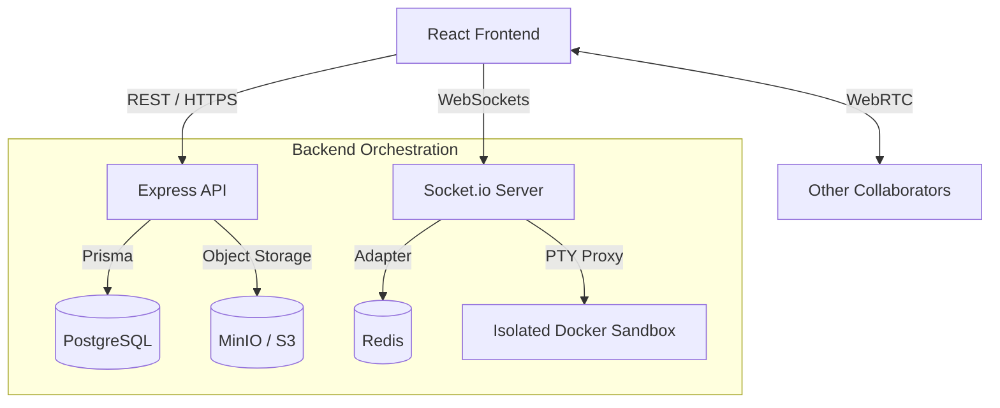

# DevCollab 🌌

[](https://github.com/syedmukheeth/DevCollab/actions)
[](https://opensource.org/licenses/MIT)
[](https://github.com/syedmukheeth/DevCollab)
[](https://eslint.org/)

**DevCollab** is a high-performance, real-time collaborative IDE designed for modern engineering teams. It features conflict-free editing (CRDT), integrated PTY shells, P2P conferencing, and a premium "Night-Owl Obsidian" design system.

---

## 🌠 The Vision
> **"How to architect a resilient, multi-tenant distributed system that provides high-fidelity, low-latency synchronization of shared developer state, while maintaining strict sandbox isolation and offering a zero-friction, premium-grade user experience."**

DevCollab is more than an editor; it's a **Collaborative Operating System for Engineers**—built to bridge the gap between local speed and cloud-scale collaboration.

---

## ✨ Key Features

- 🤝 **Enterprise Collaboration**: Conflict-free multi-user editing powered by **Yjs CRDTs** with high-fidelity awareness and cursor broadcasting.
- 🎨 **Night-Owl Obsidian UI**: A premium, obsidian-themed design system featuring **Lucide** iconography, **glassmorphism**, and fluid **Framer Motion** animations.
- 🐚 **Isolated TTY Shells**: Full terminal access inside secure **Docker** sandboxes (Alpine Linux) with real-time stream proxying via `node-pty`.
- 📹 **P2P Conferencing**: Zero-latency peer-to-peer audio and video calls integrated directly into the IDE via **WebRTC**.
- 🛠️ **Pro-Grade Editor**: Built on the **Monaco Editor** (VS Code engine) with LSP-powered IntelliSense, bracket pair colorization, and configurable settings.
- 🛡️ **Hardened Infrastructure**: Circuit breakers for resilience, Zod-validated request pipelines, and JWT-based security with strict RBAC.
- 🕒 **Time-Travel History**: Visual diffing and state snapshots for replaying project evolution.
- 🔗 **GitHub Native**: Deep integration for surrogate proxying of repository initialization, commits, and PRs.

---

## 🏗️ Technical Architecture

### Core Stack
- **Frontend**: React (Vite) + Framer Motion + Lucide React + Monaco Editor.
- **Backend**: Node.js (Express) + Socket.io + **Winston** (Structured Logging) + Circuit Breakers.
- **Database**: SQLite (Local) / PostgreSQL (Production) with **Prisma ORM**.
- **Synchonization**: **Yjs** (CRDTs) with Redis persistence & global state convergence.
- **Automation**: **ESLint v9 (Flat Config)** + GitHub Actions CI/CD Gating.

### System Design Overview



---

## 🚀 Getting Started

### Prerequisites
- **Node.js**: v18+
- **Docker**: For code execution sandboxes
- **Redis**: Required for collaborative state synchronization
- **PostgreSQL**: Primary persistent store

### Quick Start (Local)

1. **Clone & Install**:
   ```bash
   git clone https://github.com/syedmukheeth/DevCollab.git
   cd DevCollab
   # Install unified dependencies
   npm install && cd frontend && npm install
   ```

2. **Run Services**:
   ```bash
   # In terminal 1 (Backend)
   cd backend && npm run dev
   
   # In terminal 2 (Frontend)
   cd frontend && npm run dev
   ```

3. **Deploy with Docker**:
   ```bash
   docker compose --profile production up --build -d
   ```

---

## 🛠️ Quality Assurance & Gating

DevCollab maintains a **zero-warning policy** and a hardened test suite to ensure stability during scaling.

### Automated Testing (79 PASS)
```bash
cd backend && npm test
```

| Suite | Focus | Status |
|-------|-------|--------|
| **Core API** | REST Endpoints, Health, Readiness | ✅ PASS |
| **CRDT Protocol** | Convergence, Deletion, Snapshots | ✅ PASS |
| **Socket.io** | Room multiplexing, Awareness streams | ✅ PASS |
| **Sandbox** | Docker isolation, PTY stream stability | ✅ PASS |
| **Security** | JWT, RBAC, Rate-Limiting, CSP | ✅ PASS |
| **LSP Bridge** | Language Server initialization & proxy | ✅ PASS |

---

## 📝 License
Distributed under the MIT License. See `LICENSE` for more information.

---
*Built with ❤️ for the future of collaborative engineering.*
