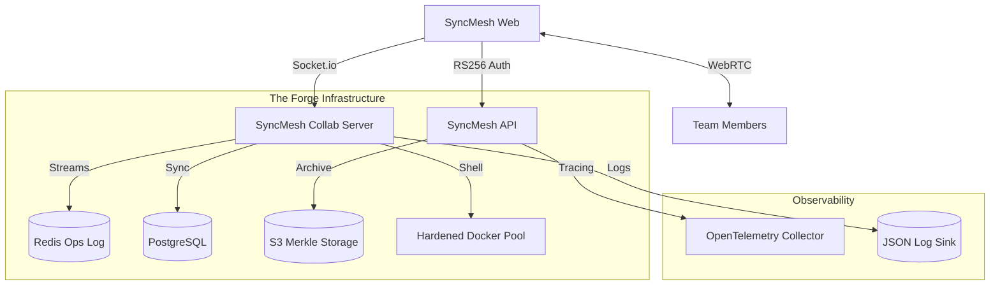

# SyncMesh 🌌

[](https://github.com/syedmukheeth/SyncMesh-Forge/actions)
[](https://opensource.org/licenses/MIT)
[](https://github.com/syedmukheeth/SyncMesh-Forge)
[](https://opentelemetry.io/)

**SyncMesh** is a production-hardened, real-time collaborative development platform engineered for modern, distributed software teams. It bridges the gap between high-performance local IDEs and the fluid scalability of cloud-native orchestration.

---

## 🌠 The Vision
> **"To architect a resilient, multi-tenant distributed forge that provides high-fidelity, low-latency synchronization of shared developer state, maintaining strict sandbox isolation and offering a zero-friction, premium-grade user experience."**

SyncMesh is the next evolution of collaborative engineering—a **Forge for the Synchronous Mesh**, where code, shell, and communication converge into a single, unified developer experience.

---

## ✨ Enterprise-Grade Features

- 🤝 **High-Fidelity Collaboration**: Conflict-free multi-user editing powered by **Yjs CRDTs** with dedicated Redis-backed operation streams and decoupled awareness channels.
- 🛡️ **Hardened Identity (RS256)**: Secure, asymmetric JWT authentication with full **RBAC** (Role-Based Access Control) and simulated Row-Level Security for strict project isolation.
- 🐚 **High-Performance Sandbox**: Secure **Docker** execution environments with **seccomp/cgroup** hardening and a **Container Pool** for <200ms cold starts.
- 🕒 **Merkle-Tree History**: Infinite, content-addressed versioning using **SHA-256** and **S3/MinIO** snapshots for point-in-time document reconstruction.
- 📹 **Integrated P2P Signaling**: Zero-latency peer-to-peer conferencing with **WebRTC** TURN server support and screen-sharing integration.
- 🔬 **Deep Observability**: Native **OpenTelemetry** instrumentation with structured JSON logging for enterprise-level tracing and monitoring.
- 🎨 **Forge Design System**: A stunning obsidian-glassmorphic interface featuring **Framer Motion** transitions and **Monaco** (VS Code engine) integration.

---

## 🏗️ Technical Architecture

### Core Stack
- **Engine**: Node.js (Express) + **OpenTelemetry** (SDK) + **Jose** (RS256).
- **Frontend**: React 18 + **Vite** + **Framer Motion** + **Tailwind CSS**.
- **Synchonization**: **Yjs** (CRDT) + **Redis Streams** (Op Log) + Socket.io (Redis Adapter).
- **Storage**: **Prisma ORM** (Postgres/SQLite) + **S3/MinIO** (Merkle Chunks).
- **Runtime**: **Dockerode** (Sandbox Orchestration) + **Node-PTY** (Terminal Bridge).

### System Topology



---

## 🚀 Deployment & Set Up

### Prerequisites
- **Docker & Compose**: For sandbox orchestration
- **Redis**: For high-performance synchronization backplane
- **Node.js**: v20+ (LTS recommended)
- **S3-Compatible Storage**: (MinIO, AWS S3, etc.)

### Quick Start

1. **Environment Config**:
   Generate your RS256 key pair and add to `.env`:
   ```bash
   openssl genrsa -out private.pem 2048
   openssl rsa -in private.pem -pubout -out public.pem
   ```

2. **Launch the Forge**:
   ```bash
   docker compose up --build -d
   ```

3. **Production Gating**:
   Run the full test suite including the **CRDT Chaos Engine**:
   ```bash
   npm test --workspace=backend
   ```

---

## 📝 License
Distributed under the MIT License. See `LICENSE` for more information.

---
*Forging the future of synchronous engineering, one update at a time.*
