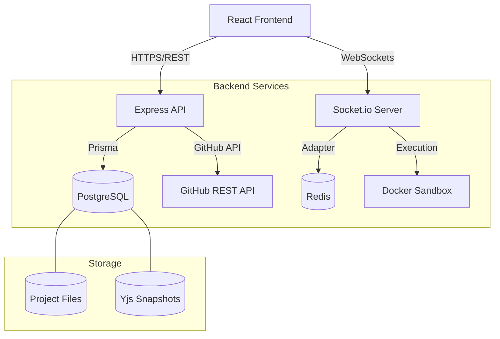
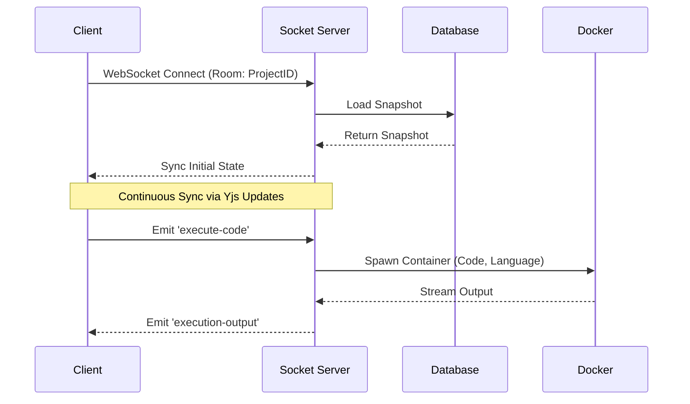

# DevCollab 🚀

[](https://github.com/syedmukheeth/DevCollab/actions)
[](https://opensource.org/licenses/MIT)
[](https://github.com/syedmukheeth/DevCollab)

**DevCollab** is a high-performance, real-time collaborative IDE designed for developers and technical interviewers. It features conflict-free editing (CRDT), integrated code execution, and seamless GitHub synchronization in a premium, modern interface.

---

## ✨ Key Features

- 🤝 **Real-time Collaboration**: Conflict-free multi-user editing powered by **Yjs** and **Socket.io**.
- 🛠️ **Integrated IDE**: Pro-grade editor using **Monaco Editor** (VS Code engine) with intelligent syntax highlighting.
- ⚡ **Secure Execution**: Run code in isolated **Docker/gVisor** sandboxes (supports Python, Node.js, Go, Java).
- 🔗 **GitHub Native**: Sync projects, commit changes, and create Pull Requests directly from the workspace.
- 🕒 **Time-Travel Debugging**: Built-in state snapshots for playback and visual diffing of file history.
- 👥 **Interview Workflows**: Dedicated mode with synchronized timers and controlled participant roles.

---

## 🏗️ Technical Architecture

### Core Stack
- **Frontend**: React (Vite) + Tailwind-inspired Glassmorphism + Monaco Editor.
- **Backend**: Node.js (Express) + Socket.io + **Winston** (Structured Logging).
- **Database**: PostgreSQL with **Prisma ORM** for relational integrity.
- **State Management**: **Yjs** (CRDTs) with Redis persistence for seamless real-time syncing.
- **Sandboxing**: Isolated Docker containers with resource limits (CPU/RAM) and network isolation.

### High-Level System Design



### Data Flow: Code Sync & Execution



### Key Components
1. **Real-time Collaboration (CRDT)**: Powered by **Yjs** with `y-socket.io`. Conflict-free editing ensures all clients converge to the same state.
2. **Code Execution Sandbox**: Isolated **Docker** containers with resource limits (CPU/Memory) and network isolation.
3. **GitHub Integration**: Seamless surrogate proxying for repository initialization, commits, and Pull Requests via **Octokit**.
4. **Persistence Layer**: Relational data management using **PostgreSQL** and the **Prisma ORM**.

### Service Observability
DevCollab provides built-in health and readiness monitoring for production stability:
- `GET /health`: Returns system uptime and resource usage.
- `GET /ready`: Verifies connectivity to PostgreSQL, Redis, and internal services.

---

## 🚀 Getting Started

### Prerequisites
- **Node.js**: v18 or higher
- **Docker**: For code execution sandboxes
- **PostgreSQL**: Primary data store
- **Redis**: Required for real-time state synchronization

### Local Installation

1. **Clone the Repository**:
   ```bash
   git clone https://github.com/syedmukheeth/DevCollab.git
   cd DevCollab
   ```

2. **Configure Environment**:
   ```bash
   cd backend
   cp .env.example .env
   # Update DATABASE_URL, REDIS_URL, and SESSION_SECRET in .env
   ```

3. **Initialize Services**:
   ```bash
   # Backend Setup
   npm install
   npx prisma generate
   npx prisma db push
   npm run dev

   # Frontend Setup (in a separate terminal)
   cd ../frontend
   npm install
   npm run dev
   ```

### Docker Deployment (Recommended)
Launch the entire production stack using Docker Compose:
```bash
docker compose up --build -d
```

---

## ⚙️ Configuration Reference

### Backend Config (`.env`)
| Variable | Description | Default |
|----------|-------------|---------|
| `PORT` | API Port | `4000` |
| `DATABASE_URL` | PostgreSQL Connection String | - |
| `REDIS_URL` | Redis Connection String | `redis://localhost:6379` |
| `SESSION_SECRET` | Secret for session encryption | - |
| `GITHUB_CLIENT_ID`| OAuth Client ID | (Optional) |

---

## 🛠️ Development & Testing

### Running Tests
DevCollab maintains high code quality with automated test suites:
```bash
cd backend
npm test
```
*Tests cover CRDT merge correctness, API endpoints, and sandbox isolation.*

---

## 🤝 Contributing
1. Fork the Project
2. Create your Feature Branch (`git checkout -b feature/AmazingFeature`)
3. Commit your Changes (`git commit -m 'Add some AmazingFeature'`)
4. Push to the Branch (`git push origin feature/AmazingFeature`)
5. Open a Pull Request

## 📝 License
Distributed under the MIT License. See `LICENSE` for more information.

---
*Built with ❤️ for the development community.*

