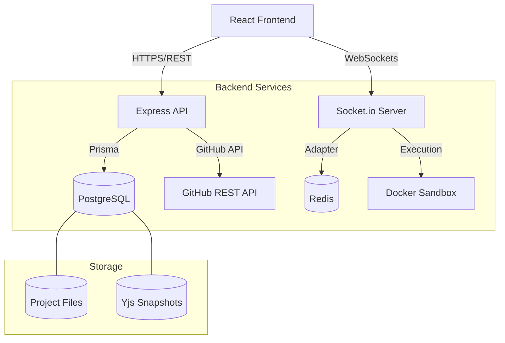
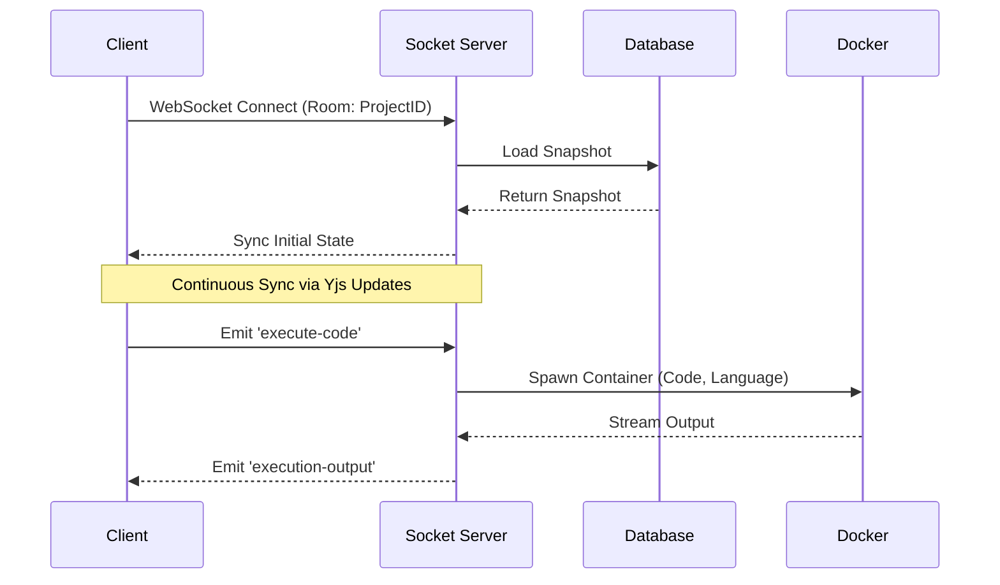

# DevCollab High-Level System Design

DevCollab is a real-time collaborative coding platform that integrates code editing, live sync via CRDTs, and GitHub source control.

## System Architecture

## Key Components

### 1. **Real-time Collaboration (CRDT)**
- **Technology**: [Yjs](https://yjs.dev/) with `y-socket.io`.
- **Flow**: Clients maintain a local Yjs document. Changes are broadcast via WebSockets. The server acts as a relay and persists snapshots/updates to PostgreSQL.
- **Consistency**: Conflict-free Replicated Data Types (CRDT) ensure all clients eventually converge to the same state without a central "truth" lock.

### 2. **Code Execution Sandbox**
- **Technology**: `dockerode` interacting with a local/remote Docker daemon.
- **Flow**: API receives code and language. Spawns an isolated container with resource limits (CPU/Memory) and no network access. Streams output (stdout/stderr) back to the client via WebSockets.

### 3. **GitHub Integration**
- **Technology**: [Octokit](https://github.com/octokit/rest.js).
- **Flow**: User authenticates via GitHub OAuth. The API acts as a proxy to initialize repositories, commit file snapshots, and create Pull Requests.

### 4. **Persistence Layer**
- **Database**: PostgreSQL managed via Prisma ORM.

## Data Flow: Code Sync & Execution

